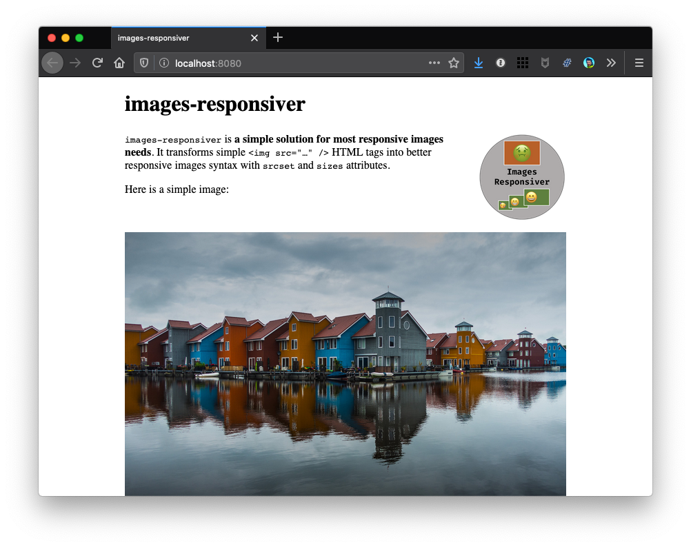
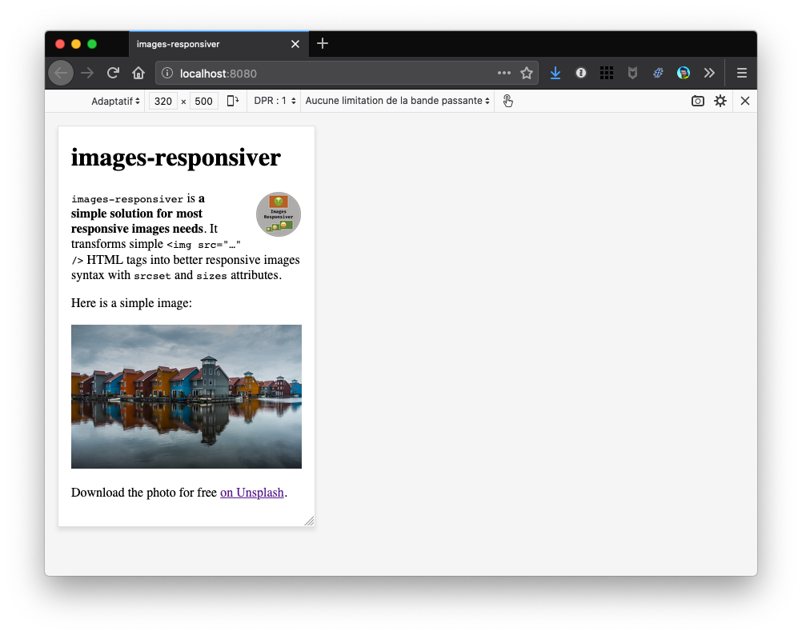

# Step 1: Default behaviour without the plugin

## Get the resources to follow this tutorial

Get the sources from the repository. You can either:

1. Download [a zip of the whole directory](https://github.com/nhoizey/eleventy-plugin-images-responsiver/archive/master.zip) and unzip it
1. or clone it with Git into your local folder (change `my-local-folder` to what you want):
   `git clone git@github.com:nhoizey/eleventy-plugin-images-responsiver.git my-local-folder`

Then go into the first example folder with your terminal:

```bash
cd my-local-folder/docs/examples/01-without-plugin
```

## Run it

There, run a clean install and build in developer mode:

```bash
npm ci
npm start
```

Sources are in `src/` and build result is in `dist/`.

## Check the result

If you open `http://localhost:8080/` in a browser, both images should be visible.

Here is a screenshot on desktop:



And here on simulated mobile:



_Note: We used the [Markdown-it Attributes plugin](https://github.com/arve0/markdown-it-attrs) to add a `logo` class to the logo image for styling (width, float on the right, etc.). This plugin allows adding attributes to elements using this syntax for example: `{.logo}`. This plugin will be useful later._

We can open this page in different browsers, on different devices, with different viewport widths and screen densities, **the very same (potentially heavy) image files will be downloaded**. Not cool for people on small devices with low resolution, and potentially bad connexions.

# Now… what?

Let's try to enhance it with the plugin in [step 2](../02-with-plugin-default/#readme).
