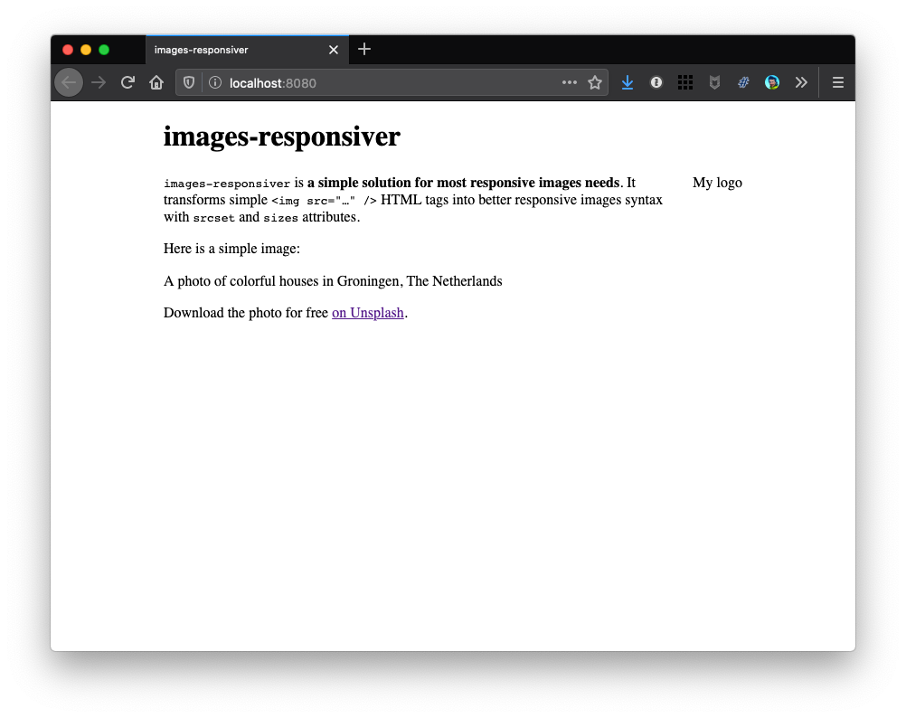
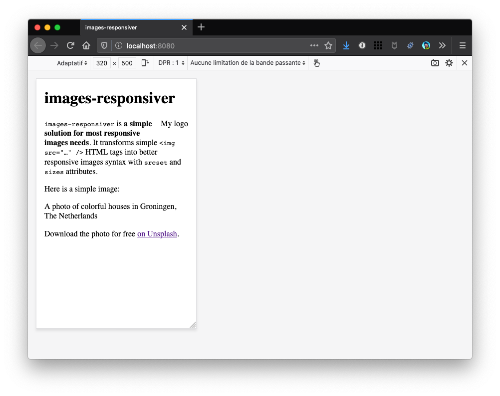

| **[<< back to home](../../)** | **[< back to step 1](../01-without-plugin/#readme)** |

# Step 2: Default behaviour with the plugin

## Run it

In the folder of the example, run a clean install then build in developer mode:

```bash
npm ci
npm start
```

Sources are in `src/` and build result is in `dist/`.

## Check the result

If you open `http://localhost:8080/` in a browser, no image should be visible… 😅

Here is a screenshot on desktop:



And here on simulated mobile:



Fortunately, there are `alt` attributes! 💪

## How does it work? (even if you might think it is not)

We installed the plugin:

```bash
npm install eleventy-plugin-images-responsiver --save-dev
```

And here's what we added to `.eleventy.js`:

```javascript
const imagesResponsiver = require('eleventy-plugin-images-responsiver');
eleventyConfig.addPlugin(imagesResponsiver);
```

This is the simplest way to add the plugin without any specific configuration.

Images are not visible because the transformed HTML (using default configuration) tells the browsers about images with names like `colorful-netherlands-320.jpg`, `colorful-netherlands-560.jpg` while we actualy only have one `colorful-netherlands.jpg`.

# Now… what?

Let's see how to provide these resized images to browsers in [step 3](../03-resized-images/#readme).
