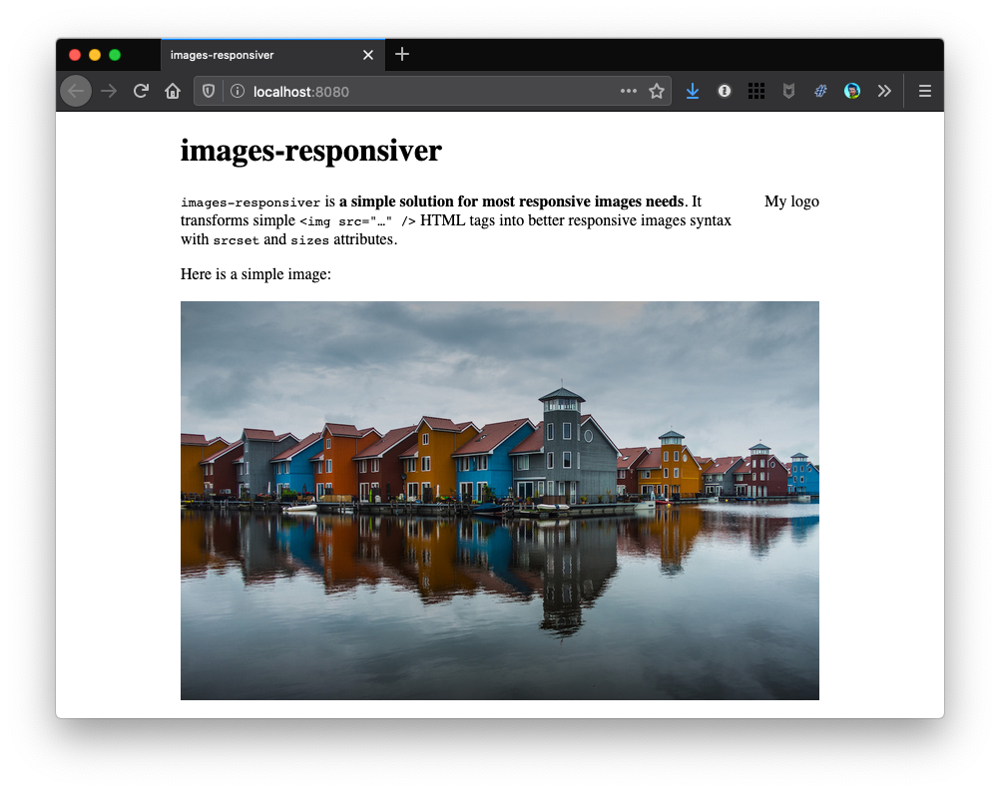
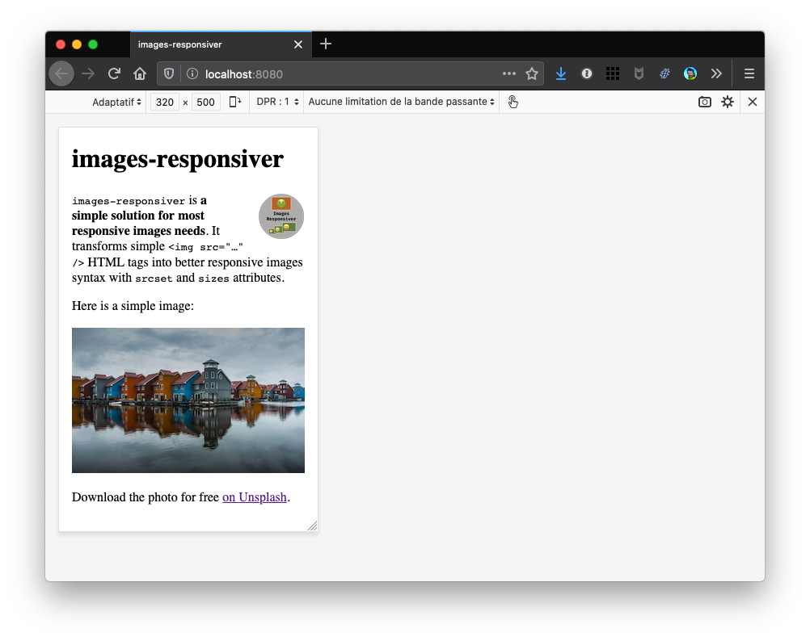

# Step 3: Resized images

## Run it

In the folder of the example, run a clean install then build in developer mode:

```bash
npm ci
npm start
```

Sources are in `src/` and build result is in `dist/`.

## Check the result

If you open `http://localhost:8080/` in a browser, images should be back. 🥳

Here is a screenshot on desktop:



And here on simulated mobile:



Oh… well, the photo is there in both screenshots, but the logo is there only on mobile… 🤔

## How does it (partially) work?

We didn't change anything in `.eleventy.js`.

We created the multiple resized images manually, so that they are available for the browser.

Unfortunately, the pristine (a.k.a. "untouched original") logo image is only 400 pixels wide, so I couldn't create images `my-logo-560.png`, `my-logo-800.png`, `my-logo-1040.png` and `my-logo-1280.png` the HTML is telling the browser about!

So while the `my-logo-320.png` version is perfect for the mobile view, the desktop view tries to load a larger one (after all, our HTML tells him it is available) and fails.

# Now… what?

So we have to find a way to tell the plugin the image's width, so that it doesn't add a larger one to the transformed HTML.

Let's see how to do this in [step 4](../04-images-dimensions/#readme)
